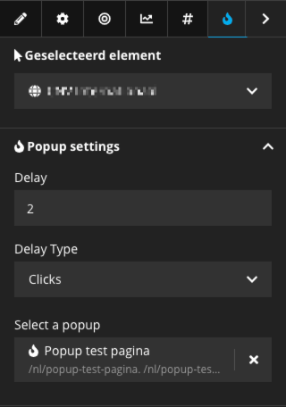

# UpAssist.PopUp

## Description
A popup implementation for Neos.
Currently supports one popup registering per page, but multiple popups can be registered over multiple pages.
Currently supports two types of pupop triggering: after X seconds or after X clicks.

## Installation
In your site package require this package `"upassist/popup":"*"`.
Run `composer require upassist/popup` in your distribution package.

## Configuration
Take a look at the Fusion files for configuring styles and js loading.
Add the mixin NodeType to the page you want to be able to add a popup too.

